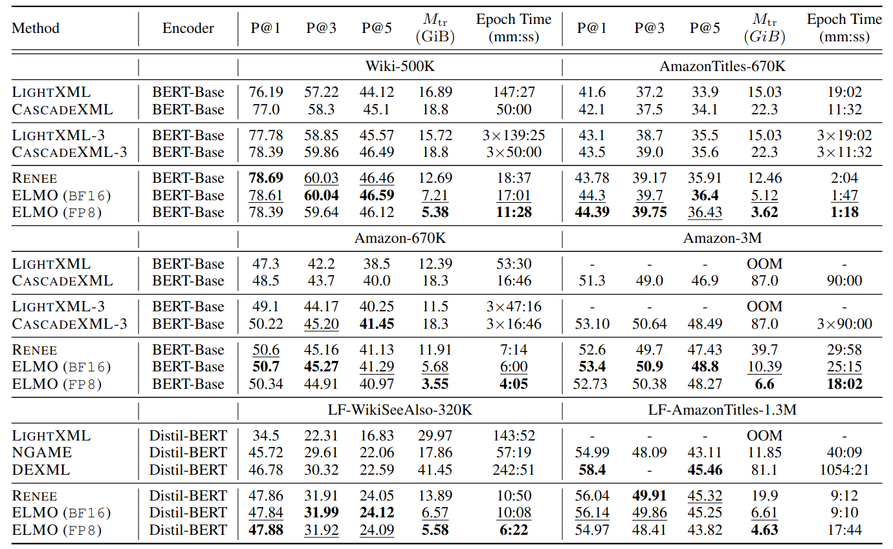
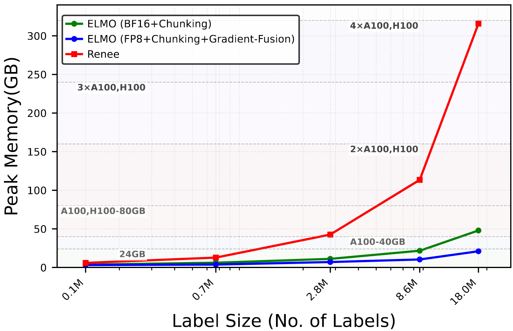

# ELMO : Efficiency via Low-precision and Peak Memory Optimization in Large Output Spaces


## Details
Official codebase for the ICML 2025 paper **ELMO: Efficiency via Low-precision and Peak Memory Optimization in Large Output Spaces**. 

This repository implements end-to-end float8 (FP8) training for the Extreme Multi-label Classification (XMC) Classifier. By leveraging techniques such as gradient fusion and memory-efficient chunking, ELMO achieves up to 10x reduction in peak memory usage on datasets with up to 8.6 million labels, enabling scalable training in large output spaces.

👉 You can find the camera-ready paper [here](https://openreview.net/pdf?id=d6CTIPrTTC).


## Key Features
- ✅ Pure Low Precision (FP8 and BF16) training throughout.
- ✅ Skip-Loss.
- ✅ Split operations and Chunking for Peak memory optimization.
- ✅ SGD optimizer with Stochastic Rounding for XMC layer.
- ✅ Fused Gradient for Peak Memory Optimization.
- ✅ FP8 Encoder with torch.ao.
- ✅ FP8 for XMC layer.

## Setup
```
conda create -y -n elmo python=3.11
conda activate elmo
bash setup_env.sh
git clone https://github.com/xmc-aalto/elmo.git
cd elmo

```


## Datasets
Download datasets from the [extreme classification repo](http://manikvarma.org/downloads/XC/XMLRepository.html).
-   [AmazonTitles-670k](https://drive.google.com/file/d/1FPqD8Wns7NXTSYDAcK4ZsqUUGABLyZMn/view)
-   [Amazon-670K](https://drive.google.com/file/d/16FIzX3TnlsqbrwSJJ2gDih69laezfZWR/view)
-   [Wiki-500K](https://drive.google.com/drive/folders/12HiiGWmbLfTEEObs2Y2jiTETZfXDowrn)
-   [Amazon-3M](https://drive.google.com/file/d/1gsabsx8KR2N9jJz16jTcA0QASXsNuKnN/view)
-   [LF-AmazonTitles-131K](https://www.dropbox.com/scl/fo/qbt00gbyt35p2h1yz05on/h?rlkey=3bf8dbq3bgns9dvfau4d9d7sx&dl=0)
-   [LF-WikiSeeAlso-320K](https://drive.google.com/file/d/1QZD4dFVxDpskCI2kGH9IbzgQR1JSZT-N/view)
-   [LF-AmazonTitles-1.3M](https://www.dropbox.com/scl/fo/k4bz3mrz18rtmbjm7xqzl/h?rlkey=0u9h5p5s0cn7wuhpeu20yhvzn&dl=0)
-  [LF-Paper2keywords-8.6M]()


## Running 
1. Setup environment based on the installation instructions above.
2. Run ``python src/main.py data=dataset  dataset_path=./data log_fname=log_dataset ``

[where `dataset_path` is root path and in `data=dataset` dataset argument names are amazon670k, amazontitles670k, wiki500k, amazon3m, lfamazontitles131k, lfamazontitles1.3m, lfwikiseealso320k, lfpaper2keywords]

All training is managed through `src/main.py` and configured using [Hydra]((https://hydra.cc/)). The base configuration for each dataset is located in `config/dataset/`. You can set parameters in the config file or command line. The performance is shown in wandb or log files.


## Sample Run Scripts

**Pure Bfloat16 training on AmazonTitles-670K**

```bash 
python src/main.py dataset=amazontitles670k log_fname=log_bf16_at670k dataset_path=Datasets dataset.model.xmc.implementation=chunked

```

**Pure FP8 Training on AmazonTitles-670K (Require Hopper, Ada, Blackwell cards)**

```bash 
python src/main.py dataset=amazontitles670k log_fname=log_fp8_at670k dataset_path=Datasets dataset.model.xmc.implementation=fp8chunked dataset.training.FP8.use_fp8_encoder=True
```

**Simulated FP8 Training on AmazonTitles-670K (Any card supports Bfloat16)**

This runs a FP8 training where parameters are stored in FP8, but the matrix multiplication is performed in BFloat16. Keep memory benefits of FP8 training.

``` bash
python src/main.py dataset=amazontitles670k log_fname=log_sfp8_at670k dataset_path=Datasets dataset.model.xmc.implementation=fp8chunked dataset.training.FP8.use_fp8_encoder=False dataset.training.xmc.simulated_fp8=True
```


### Torchao and NVIDIA RTX 40 series Ada cards(e.g., 4060 Ti)

Torchao doesn't support FP8 encoder for some Ada cards so encoder could be set to bf16 as its memory is negligible compared to classifier.

```bash 
python src/main.py dataset=amazontitles670k log_fname=log_fp8_fp8enc_at670k dataset_path=Datasets dataset.model.xmc.implementation=fp8chunked dataset.training.FP8.use_fp8_encoder=False
```

## Performance

## Memory usage vs labels set size


## You May Also Like

1. [Navigating Extremes: Dynamic Sparsity in Large Output Spaces (NeurIPS 2024)](https://github.com/xmc-aalto/NeurIPS24-dst/tree/main)
2. [Towards Memory-Efficient Training for Extremely Large Output Spaces – Learning with 500k Labels on a Single Commodity GPU (ECML 2023)](https://github.com/xmc-aalto/ecml23-sparse)

## Citation
If you find our work/code useful in your research, please cite the following:
```bibtex
@inproceedings{
zhang2025elmo,
title={{ELMO} : Efficiency via Low-precision and Peak Memory Optimization in Large Output Spaces},
author={Jinbin Zhang and Nasib Ullah and Erik Schultheis and Rohit Babbar},
booktitle={Forty-second International Conference on Machine Learning},
year={2025},
url={https://openreview.net/forum?id=d6CTIPrTTC}
}
```
## References
1. [The Extreme Classification Repository](http://manikvarma.org/downloads/XC/XMLRepository.html)

2. [Renee: End-to-end training of extreme classification models](https://github.com/microsoft/renee/tree/main)

3. [pyxclib](https://github.com/kunaldahiya/pyxclib)


